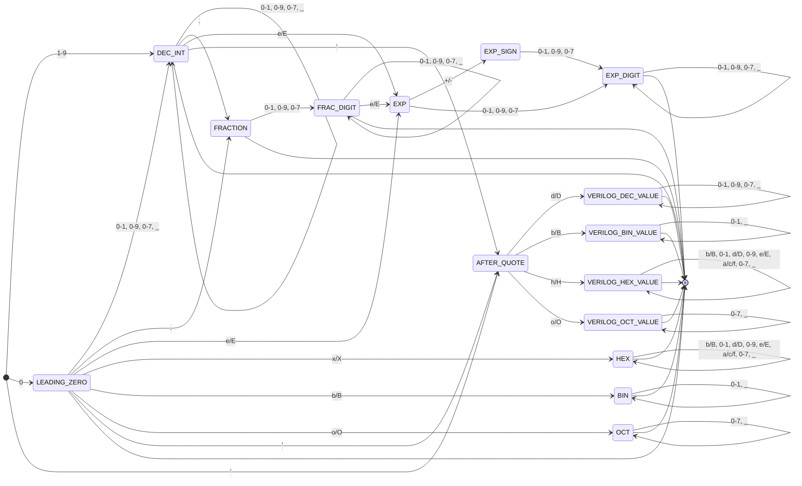

<!-- 更新方式: python scripts/gen_mermaid_fsm.py -o docs/fsm_diagram.md -->

```mermaid
stateDiagram-v2
    direction LR
    [*] --> DEC_INT: 1-9
    [*] --> LEADING_ZERO: 0
    [*] --> AFTER_QUOTE: '
    DEC_INT --> DEC_INT: 0-1, 0-9, 0-7, _
    DEC_INT --> FRACTION: .
    DEC_INT --> EXP: e/E
    DEC_INT --> AFTER_QUOTE: '
    LEADING_ZERO --> DEC_INT: 0-1, 0-9, 0-7, _
    LEADING_ZERO --> FRACTION: .
    LEADING_ZERO --> EXP: e/E
    LEADING_ZERO --> HEX: x/X
    LEADING_ZERO --> BIN: b/B
    LEADING_ZERO --> OCT: o/O
    LEADING_ZERO --> AFTER_QUOTE: '
    FRACTION --> FRAC_DIGIT: 0-1, 0-9, 0-7
    FRAC_DIGIT --> FRAC_DIGIT: 0-1, 0-9, 0-7, _
    FRAC_DIGIT --> EXP: e/E
    EXP --> EXP_SIGN: +/-
    EXP --> EXP_DIGIT: 0-1, 0-9, 0-7
    EXP_SIGN --> EXP_DIGIT: 0-1, 0-9, 0-7
    EXP_DIGIT --> EXP_DIGIT: 0-1, 0-9, 0-7, _
    HEX --> HEX: b/B, 0-1, d/D, 0-9, e/E, a/c/f, 0-7, _
    BIN --> BIN: 0-1, _
    OCT --> OCT: 0-7, _
    AFTER_QUOTE --> VERILOG_DEC_VALUE: d/D
    AFTER_QUOTE --> VERILOG_BIN_VALUE: b/B
    AFTER_QUOTE --> VERILOG_HEX_VALUE: h/H
    AFTER_QUOTE --> VERILOG_OCT_VALUE: o/O
    VERILOG_DEC_VALUE --> VERILOG_DEC_VALUE: 0-1, 0-9, 0-7, _
    VERILOG_BIN_VALUE --> VERILOG_BIN_VALUE: 0-1, _
    VERILOG_HEX_VALUE --> VERILOG_HEX_VALUE: b/B, 0-1, d/D, 0-9, e/E, a/c/f, 0-7, _
    VERILOG_OCT_VALUE --> VERILOG_OCT_VALUE: 0-7, _
    BIN --> [*]
    DEC_INT --> [*]
    EXP_DIGIT --> [*]
    FRACTION --> [*]
    FRAC_DIGIT --> [*]
    HEX --> [*]
    LEADING_ZERO --> [*]
    OCT --> [*]
    VERILOG_BIN_VALUE --> [*]
    VERILOG_DEC_VALUE --> [*]
    VERILOG_HEX_VALUE --> [*]
    VERILOG_OCT_VALUE --> [*]
```
