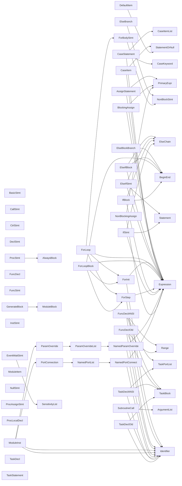

```mermaid
graph LR
    AlwaysBlock["AlwaysBlock"]
    ArgumentList["ArgumentList"]
    AssignStatement["AssignStatement"]
    BasicStmt["BasicStmt"]
    BeginEnd["BeginEnd"]
    BlockingAssign["BlockingAssign"]
    CallStmt["CallStmt"]
    CaseItem["CaseItem"]
    CaseItemList["CaseItemList"]
    CaseKeyword["CaseKeyword"]
    CaseStatement["CaseStatement"]
    CtrlStmt["CtrlStmt"]
    DeclStmt["DeclStmt"]
    DefaultItem["DefaultItem"]
    ElseBlockBranch["ElseBlockBranch"]
    ElseBranch["ElseBranch"]
    ElseChain["ElseChain"]
    ElseIfBlock["ElseIfBlock"]
    ElseIfStmt["ElseIfStmt"]
    EventWaitStmt["EventWaitStmt"]
    Expression["Expression"]
    ForBodyStmt["ForBodyStmt"]
    ForInit["ForInit"]
    ForLoop["ForLoop"]
    ForLoopBlock["ForLoopBlock"]
    ForStep["ForStep"]
    FuncDecl["FuncDecl"]
    FuncDeclANSI["FuncDeclANSI"]
    FuncDeclOld["FuncDeclOld"]
    FuncStmt["FuncStmt"]
    GenerateBlock["GenerateBlock"]
    Identifier["Identifier"]
    IfBlock["IfBlock"]
    IfStmt["IfStmt"]
    InstStmt["InstStmt"]
    ModuleBlock["ModuleBlock"]
    ModuleInst["ModuleInst"]
    ModuleItem["ModuleItem"]
    NamedParamOverride["NamedParamOverride"]
    NamedPortConnect["NamedPortConnect"]
    NamedPortList["NamedPortList"]
    NonBlockStmt["NonBlockStmt"]
    NonBlockingAssign["NonBlockingAssign"]
    NullStmt["NullStmt"]
    ParamOverride["ParamOverride"]
    ParamOverrideList["ParamOverrideList"]
    PortConnection["PortConnection"]
    PrimaryExpr["PrimaryExpr"]
    ProcAssignStmt["ProcAssignStmt"]
    ProcLocalDecl["ProcLocalDecl"]
    ProcStmt["ProcStmt"]
    Range["Range"]
    SensitivityList["SensitivityList"]
    Statement["Statement"]
    StatementOrNull["StatementOrNull"]
    SubroutineCall["SubroutineCall"]
    TaskBlock["TaskBlock"]
    TaskDecl["TaskDecl"]
    TaskDeclANSI["TaskDeclANSI"]
    TaskDeclOld["TaskDeclOld"]
    TaskPortList["TaskPortList"]
    TaskStatement["TaskStatement"]
    AssignStatement --> PrimaryExpr
    AssignStatement --> Expression
    BlockingAssign --> PrimaryExpr
    BlockingAssign --> Expression
    CaseItem --> Expression
    CaseItem --> StatementOrNull
    CaseStatement --> CaseKeyword
    CaseStatement --> Expression
    CaseStatement --> CaseItemList
    DefaultItem --> StatementOrNull
    ElseBlockBranch --> BeginEnd
    ElseBranch --> NonBlockStmt
    ElseIfBlock --> Expression
    ElseIfBlock --> BeginEnd
    ElseIfBlock --> ElseChain
    ElseIfStmt --> Expression
    ElseIfStmt --> Statement
    ElseIfStmt --> ElseChain
    EventWaitStmt --> SensitivityList
    ForBodyStmt --> NonBlockStmt
    ForInit --> Identifier
    ForInit --> Expression
    ForLoop --> ForInit
    ForLoop --> Expression
    ForLoop --> ForStep
    ForLoop --> ForBodyStmt
    ForLoopBlock --> ForInit
    ForLoopBlock --> Expression
    ForLoopBlock --> ForStep
    ForLoopBlock --> BeginEnd
    ForStep --> Identifier
    ForStep --> Expression
    FuncDeclANSI --> Range
    FuncDeclANSI --> Identifier
    FuncDeclANSI --> TaskPortList
    FuncDeclANSI --> TaskBlock
    FuncDeclOld --> Range
    FuncDeclOld --> Identifier
    FuncDeclOld --> TaskBlock
    GenerateBlock --> ModuleBlock
    IfBlock --> Expression
    IfBlock --> BeginEnd
    IfBlock --> ElseChain
    IfStmt --> Expression
    IfStmt --> Statement
    IfStmt --> ElseChain
    ModuleInst --> Identifier
    ModuleInst --> ParamOverride
    ModuleInst --> Identifier
    ModuleInst --> PortConnection
    NamedParamOverride --> Identifier
    NamedParamOverride --> Expression
    NamedPortConnect --> Identifier
    NamedPortConnect --> Expression
    NamedPortList --> NamedPortConnect
    NonBlockingAssign --> PrimaryExpr
    NonBlockingAssign --> Expression
    ParamOverride --> ParamOverrideList
    ParamOverrideList --> NamedParamOverride
    PortConnection --> NamedPortList
    ProcStmt --> AlwaysBlock
    SubroutineCall --> Identifier
    SubroutineCall --> ArgumentList
    TaskDeclANSI --> Identifier
    TaskDeclANSI --> TaskPortList
    TaskDeclANSI --> TaskBlock
    TaskDeclOld --> Identifier
    TaskDeclOld --> TaskBlock
```

--- 统计 ---
节点:  62  边:  68  孤立:  30