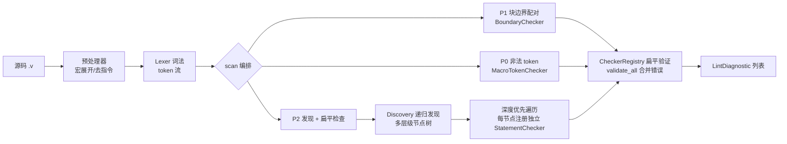
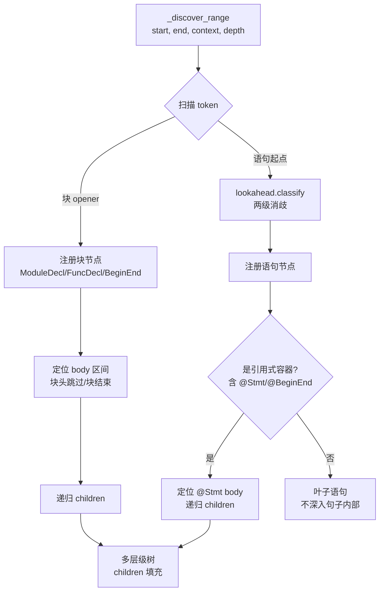
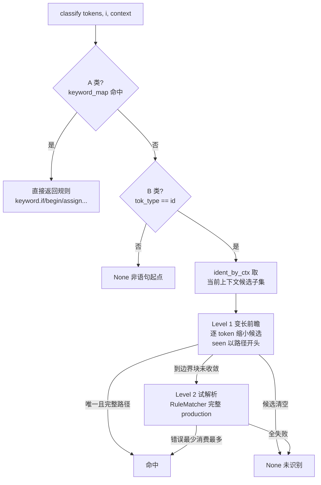

# Linter 架构设计

> 状态：实现完成（2026-08-02，commit 743c921）
> 全量验证：pytest 231 + run_all 35 (FAIL 0) + normal 28/28 + errors 3/3
> 本文档记录"发现 + 扁平检查"两阶段架构 + 多层级递归发现 + 动态两级消歧。

## 设计哲学

- **production 即真相**：句子结束符、句子角色（is_statement/is_block）从 production 推导，
  不手写、不往 end_case 加值（end_case 配置零改动）。
- **发现与检查解耦**：发现阶段把 token 流变形成轻量 AST（节点树），检查阶段对每个节点
  独立扁平验证，单个检查器失败不影响其他。
- **接受误报 + 边界管理**：已知边界问题（多行 RHS、`@*` 敏感列表、while/repeat 无完整规则）
  记录在 TODO.md 后置，不阻塞主流程。

---

## 1. 整体流水线（scanner.py）



核心设计：**发现一次 → 注册扁平检查器列表 → 逐个独立 validate → 合并错误**。
检查器之间无耦合（单个失败不影响其他），这是扁平架构的解耦收益。

`scan()` 三个阶段：
- **P1 块边界配对**：`BoundaryChecker` 检查括号/块起止符配对（栈式）。
- **P0 非法 token 检查**：`MacroTokenChecker` 检查未展开的宏等非法 token。
- **P2 语句发现 + 扁平检查**：Discovery 产出多层级节点树 → 深度优先遍历，把每个节点
  （含 children）注册为独立 `StatementChecker` → 扁平验证。

---

## 2. 发现阶段（discovery.py）— 多层级递归



关键机制：

- **层级最多到句子级**：递归进入复合语句 body 发现句子节点，但**不深入句子内部**
  （表达式/字面量等黑盒交给 ExpressionChecker）。层级边界就是"句子"。
- **容器两类**：
  - 块式（is_block）：`BeginEnd`/`ModuleDecl`/`FuncDecl`/`TaskDecl`/`GenerateBlock`，
    body = 块头后 ~ 块结束前。
  - 引用式：production 含 `@Stmt`/`@BeginEnd`（`AlwaysStmt`/`IfStmt`/`ForLoop`/`CaseStmt`/
    `EventWaitStmt`），body 由 `_locate_stmt_body`（复用 matcher 逐元素匹配）定位。
- **块头跳过**：module/function/task 的声明头以分号收尾（`_has_semicolon_header` 递归查
  production 分号），注册块后跳到 body 开始，避免函数名/模块名被误判为语句。
- **句子结束符从 production 推导**（`_derived_end_case`）：production 结尾纯字面 token
  （如分号）即句子天然结束边界。仅对非容器规则推导，恢复模块级/过程体内缺分号检测。
- **上下文 + 深度栈**：块容器按 `opener_context` 切上下文（module→module_body、
  begin→proc_body、function/task→proc_body、generate→gen_body）；引用式 `@Stmt`→proc_body。
  depth 参数防循环。

实测示例：

```
ModuleDecl
├─ RegDecl
├─ AlwaysStmt
│  └─ BeginEnd
│     ├─ IfBlock/IfStmt
│     │  └─ BeginEnd
│     │     ├─ NonBlockingAssign
│     │     └─ BeginEnd (else)
│     │        └─ NonBlockingAssign
│     └─ NonBlockingAssign
└─ InitialStmt
   └─ BeginEnd
      └─ BlockingAssign
```

---

## 3. 动态两级路径消歧（lookahead.py）



### 配置驱动的候选表

- **A 类**（关键字/具体符号触发）：`keyword_map` —— 规则 first token → 规则名列表，
  不区分上下文（如 `keyword.if`/`keyword.begin`/`keyword.assign`）。
- **B 类**（标识符触发）：`ident_by_ctx[context]` —— 上下文 → 候选子集（变长，不预写死
  key）。候选从 `statement_entry` 入口选择器（Stmt/ModuleItem/TaskStmt）沿纯 @ 分派展开
  的叶子集归属。

### Level 1：变长前瞻

- 每条 B 类候选规则预计算「**判别前缀路径集**」：从 production（id 之后）展开，遇表达式
  黑盒/语句/块/非原子 call 即截断（前缀只覆盖"能区分候选"的部分）。
- 消歧：逐个预视 token，用 `seen 以某路径开头` 匹配淘汰候选。
- **命中条件**：候选唯一 且 seen 恰好等于其一条完整判别路径（前缀匹配不命中——防止
  `module test #(...)` 的 `#` 前缀误判为参数化实例化）。
- **空 paths 候选**（无静态前缀可判）不参与淘汰，单独留到 Level 2。
- **前瞻深度上界 = 语句边界块**（分号/块结束），不穿透，天然有界。

示例：

| 实际序列（proc_body） | 判别 | 结果 |
|----------------------|------|------|
| `foo = bar;` | seen `[=]` | BlockingAssign |
| `foo <= bar;` | seen `[<=]` | NonBlockingAssign |
| `foo(bar);` | seen `[ ( ]` | SubroutineCall |
| `foo u1(...);`（module_body） | seen `[id, (]` | ModuleInst（2-token 预视） |
| `module test #(...)`（module_body） | seen `[#,(]` 不匹配 `[#,id,(]` | None（不误判） |

### Level 2：试解析兜底

- **路由条件**（任一即降级）：候选 production 含深层 call（参数列表/端口连接/参数覆盖）、
  变长前瞻到边界块仍无法收敛、候选无静态前缀（空 paths）。
- 对每个候选用 `RuleMatcher` **完整 production 试解析**（临时错误列表，静默），取
  "错误最少、其次消费最多"者；全失败 → None（未识别）。

---

## 4. 配置驱动（pyv.toml [linter] + TOML 规则）

```mermaid
flowchart LR
    A[grammar/*.toml] --> B[core/define.py<br/>GrammarRule + derive_rule_roles<br/>is_statement/is_block 推导]
    B --> C[grammar_slicer.py<br/>build_slice_tree<br/>production → feature 树]
    C --> D[lookahead 消歧表<br/>keyword_map / ident_by_ctx]
    C --> E[discovery 递归]
    C --> F[RuleMatcher 检查]
    G[pyv.toml [linter]] -->|opener_context| E
    G -->|module_item_rule/stmt_rule| D
```

- **选入字段** `statement_entry = true`：标记 `Stmt`/`TaskStmt`/`ModuleItem` 三个语句入口
  选择器，是句子注册的开关——其下所有非原子叶子自动成为可发现句子。
- **is_statement 推导**（`derive_rule_roles`）：块规则（is_block+block_start）天然语句 +
  入口选择器沿纯 @ 分派递归展开（非传递闭包，防 Expression/ParamDecl 误判）。
- **lookahead 叶子集**：`_context_leaves` 从 pyv.toml 的 `module_item_rule`/`stmt_rule`
  展开（与 derive_rule_roles 入口来源不同、逻辑一致）。
- **opener_context**：块 opener token → 消歧上下文映射。

---

## 5. 检查阶段（scanner.py + checkers/）

```mermaid
flowchart LR
    A[多层级节点树] --> B[深度优先遍历]
    B --> C[StatementChecker<br/>按 production 匹配区间]
    C --> D[RuleMatcher 共享匹配器]
    D --> E[token/choice/optional/repeat/call 匹配]
    D --> F[ExpressionChecker<br/>@Expression pratt 完整 / @PrimaryExpr 原子]
    C --> G[嵌套 @Stmt → end_case 扁平跳过<br/>由独立子 checker 检查]
```

- **父节点**按 production 匹配自身区间（`@Stmt` 由 matcher 用 end_case 扁平跳过，不深入
  子语句）——避免与子节点重复报错。
- **子节点**独立检查自身区间（扁平验证）。
- **@PrimaryExpr 只匹配原子**（不消费运算符）——解决 `a <= b` 赋值 vs 比较歧义；
  **@Expression 完整 pratt**。
- **matcher trivia 处理**：`_match_choice`/`@Expression` 先跳过 trivia，避免多行表达式 /
  case item 从行首 newline 消费错位。

---

## 6. 已知边界问题（TODO.md 后置）

| 问题 | 根因 | 现状 |
|------|------|------|
| 表达式内运算符后换行（多行 RHS）误报 | pratt 无 newline trivia 跳过 | 记录 TODO，不阻塞 |
| `always @*` 敏感列表误判 | `@*` 与 `@(...)` 消歧边界 | 记录 TODO |
| while/repeat 无完整语法规则 | 已补关键字，无语句规则 | body 语句仍被发现，结构不检查 |

## 文件职责一览

| 文件 | 职责 |
|------|------|
| `linter/scanner.py` | 编排 P1/P0/P2；深度优先注册节点 checker |
| `linter/discovery.py` | 递归发现器：容器 children、块头跳过、结束符推导、上下文/深度 |
| `linter/lookahead.py` | 前瞻消歧表 + 动态两级消歧（变长前瞻 + 试解析） |
| `linter/grammar_slicer.py` | build_slice_tree：GrammarRule → feature 树 |
| `linter/checkers/statement.py` | 语句检查器（块规则先消费 block_start + 多候选取优） |
| `linter/checkers/matcher.py` | 共享规则匹配器（token/choice/optional/repeat/call） |
| `linter/checkers/expression.py` | 表达式检查器（pratt + 原子，含 part-select） |
| `linter/checkers/boundary.py` | 块/括号边界配对（P1） |
| `linter/checkers/macro_token.py` | 非法 token 检查（P0） |
| `linter/_constants.py` | 共享 token 类型常量 |
| `linter/checker.py` | Checker 协议 + 注册表 + DiscoveredNode |
